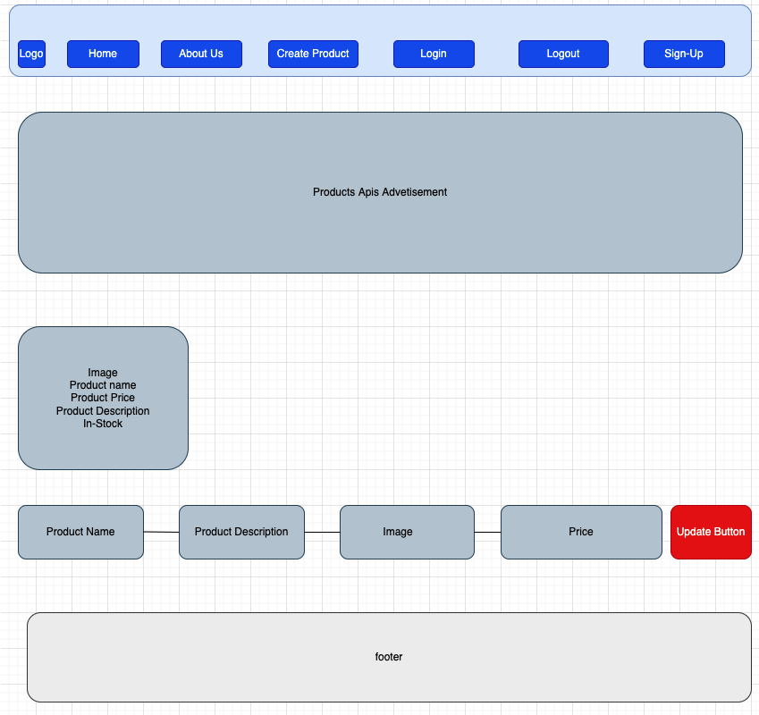

# MERN Stack - Products APP

> Products website built with the MERN stack with ReactJS.ExpressJS.React_Router

## Demo:

## Author: Phong Nguyen

### Wide-Frame

## Install dependencies for server

### `npm install`

## Install dependencies for client

### cd client ---> `npm install`

## Connect to your mongodb and add info in .env

##

## Run the client & server with concurrently

### `npm run dev`

## Run the Express server only

### `npm run server`

## Run the React client only

### `npm run client`
