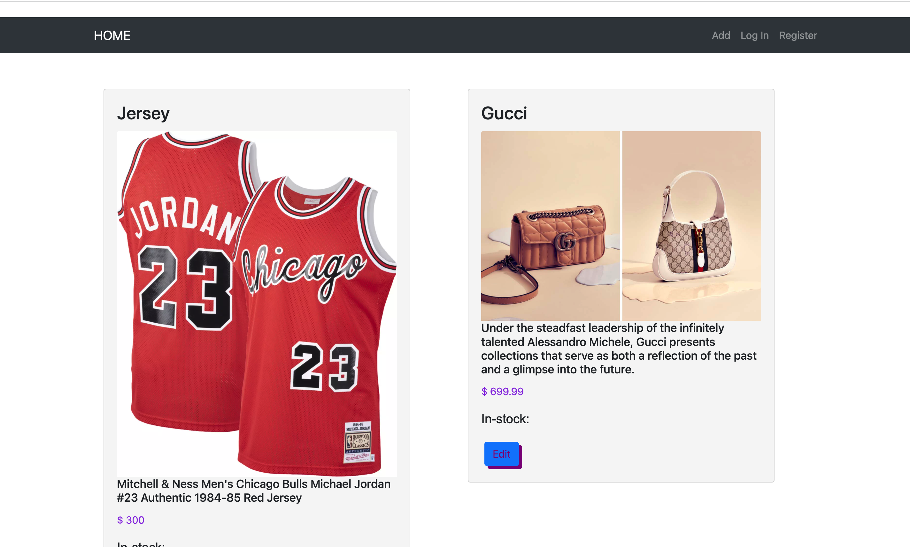
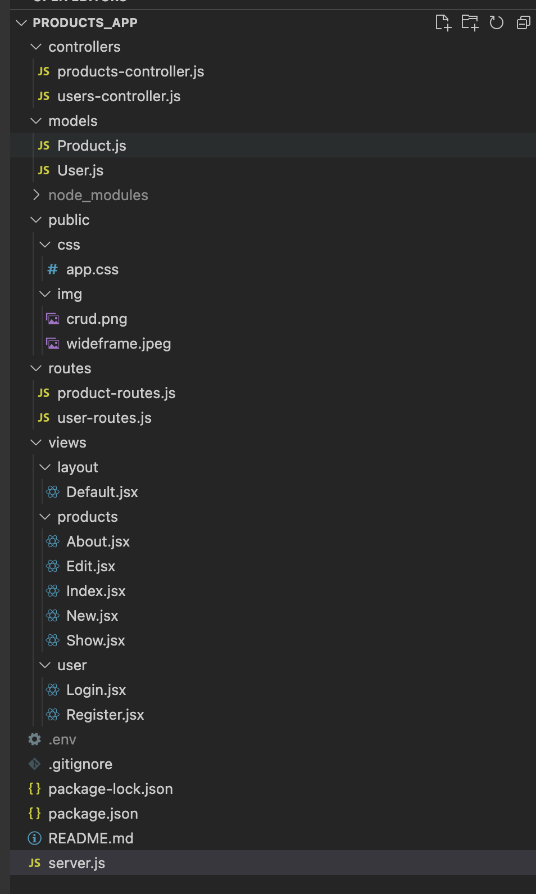

# MERN Full-Stack - Products APIS

## About 
This is a simple e-commerce marketing products app which allows user to keep track of their products when they create/edit or update. User be able to save all their products that will save into a database.

### Brief Overview
* This project was built using 2 repos: 1 front-end an 1 back-end. 
* The back-end implements RESTful routing, CRUD operations, and connects to a MongoDB. 
* THe front-end implements NextJs -> React Front-End -> Node/Express server rendering.

## Demo
### Heroku link https://products-apiss.herokuapp.com/products 

## Author: Phong Nguyen

### Wide-Frame

## Technologies Used
* HTML, CSS, JScript
* NodeJS, Express, REACT, MongoDB, Heroku
* POSTMAN, VSCODE
* Wideframe.cc

## Resources
* `Bootstrap ^5.1.3"`
* WideFrame: [Horizontal Nav Bar](https://app.diagrams.net/),
* Bootstrap v.4.6.1: [Primary Button](https://getbootstrap.com/docs/4.6/components/buttons/)
* W3 Schools: [Horizontal Nav Bar](https://www.w3schools.com/css/css_navbar_horizontal.asp),

### `snapshot front-end`

### `snapshot front-end`

